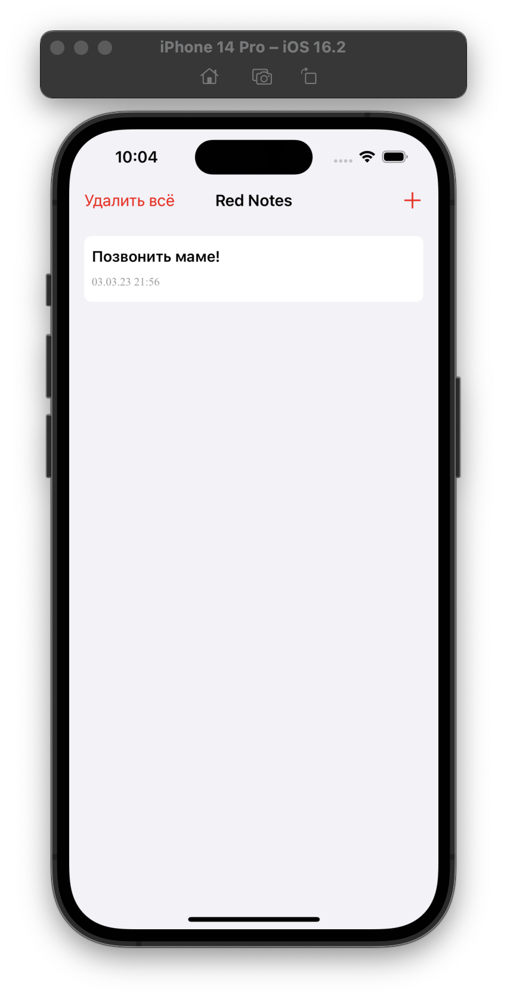
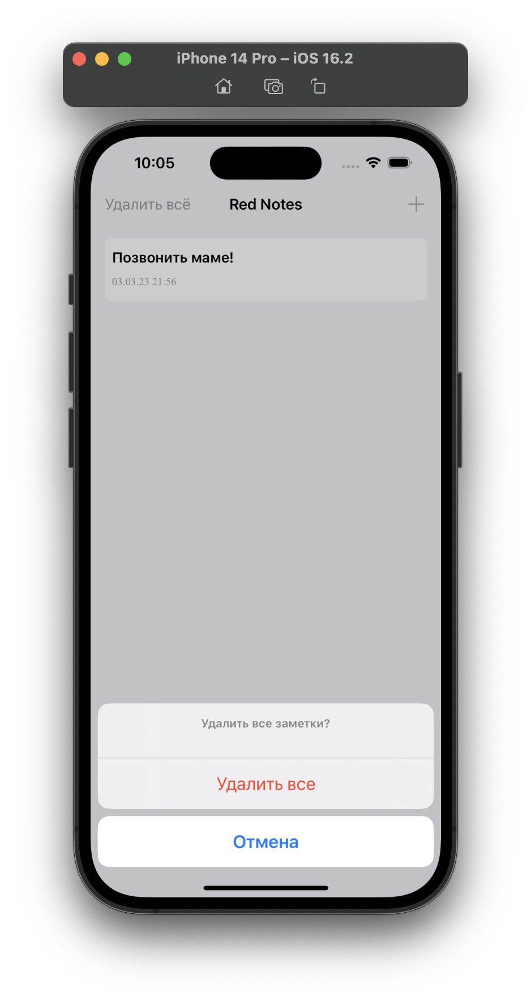
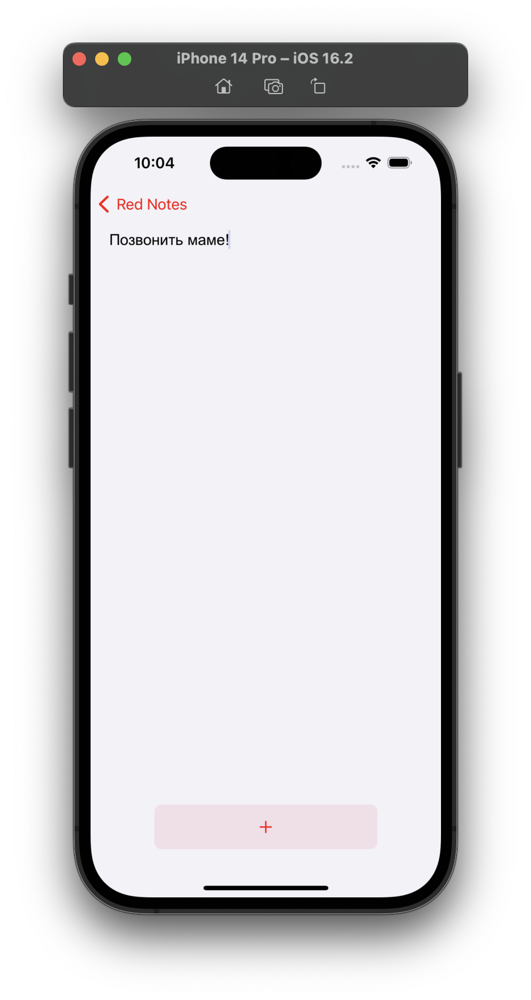
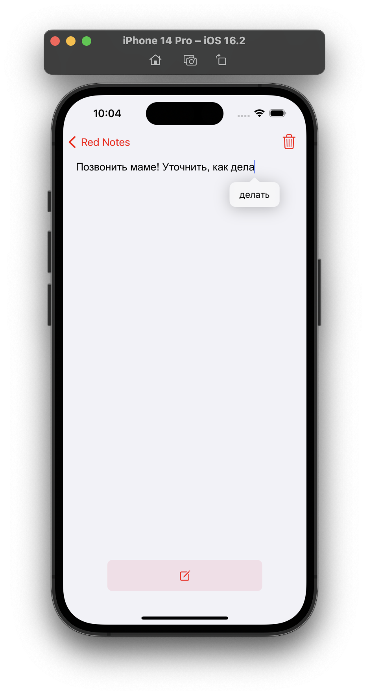

# RedNotes
> Приложение для заметок, позволяет добавлять новые, редактировать старые и удалять ненужные.


## Использованы технологии 

- UIKit
- SnapKit
- Swift Package Manager
- AutoLayout
- Compositional Layout
- Without Storyboard
- CoreData

### Главный экран - показывает созданные заметки
> Помимо показа всех заметок, на главном экране есть возможность удаления всех заметок и добавления новой. По нажатию на заметку, происходит переход к её редактированию.

### Удаление всех заметок
> На скриншоте показан алерт удаления всех элементов

### Экран добавления и редактирования заметки.
> Вид кнопки меняется в зависимости от условий добавить/изменить заметку

| Добавление  | Изменение |
|  :---: |  :---: |
|   |   |
